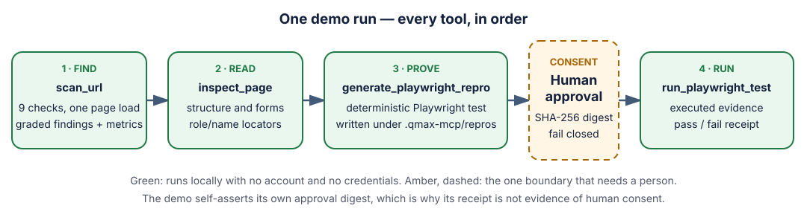
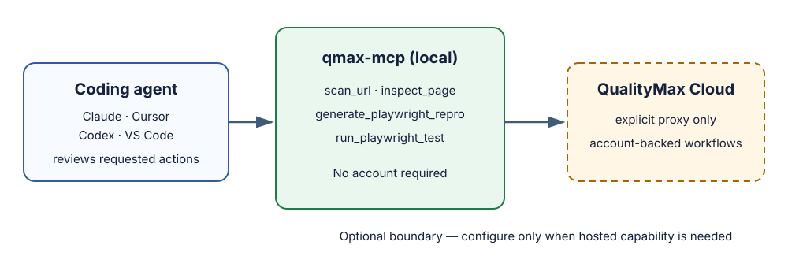

# QualityMax QA MCP

[](https://www.npmjs.com/package/@qualitymax/qmax-mcp)
[](https://www.npmjs.com/package/@qualitymax/qmax-mcp)
[](LICENSE)
[](https://nodejs.org/)
[](https://qualitymax.io)
[](https://discord.gg/kbEC28D4)
[](https://buymeacoffee.com/qualitymax)

Give a coding agent independent QA evidence before it declares a web change done: scan the page, inspect the UI, generate a focused Playwright repro, then review the execution result.

```bash
npx -y @qualitymax/qmax-mcp
```

The four local tools require no QualityMax account, API key, or hosted service.

## Start with a useful result

Ask an MCP-enabled agent to scan the URL it changed, or run the local CLI:

```bash
npx -y @qualitymax/qmax-mcp scan https://example.com --format markdown
```

The report includes a graded summary, findings, concrete reproduction steps, and suggested fixes. One command exercises all four tools against a checked-in, dependency-free fixture — see the [reproducible demo](demo/README.md).



### What one scan measures

All nine checks run off a single page load. Pass `checks` to run a subset.

| Check | What it reports |
| --- | --- |
| `console` | JavaScript errors, warnings, and failed requests |
| `links` | Broken and redirecting links, up to `maxLinks` |
| `accessibility` | Missing alt text, unlabelled controls, nameless interactive elements, heading structure |
| `performance` | Core Web Vitals: LCP, CLS, TTFB, FCP |
| `seo` | Title and meta description |
| `security_headers` | CSP, HSTS, `X-Content-Type-Options`, `Referrer-Policy` |
| `cookies` | Missing `Secure`/`HttpOnly`/`SameSite`, third-party cookies, known trackers, tracking before consent |
| `mixed_content` | HTTP subresources and form actions on an HTTPS page, split into browser-blocked active and passive |
| `weight` | Transfer bytes, request count, render-blocking resources, oversized and uncompressed assets, third-party cost |

Names must match exactly. An unrecognised name is rejected with the supported list rather than skipped, so a typo cannot quietly turn a check off and still return a score.

`scan_url` also returns a `metrics` block with the measured vitals and the page-weight breakdown, including the slowest requests. Two limits are stated in that block rather than hidden: **INP is not measured**, because it needs real user interaction, and vitals come from one cold load on the scanning machine, not from field data. Set `weightBudget` to scan against your own performance budget.

### What the report looks like

`--format markdown` opens with the shape of the result, so a human or an agent can see where the problems are before reading a single finding:

> **Grade: 🔴 F  (0 / 100)**   ·   17 issues found
>
> `░░░░░░░░░░░░░░░░░░░░░░░░` 0 / 100
>
> | Category | Issues | Worst |
> |----------|--------|:-----:|
> | Console errors | `██░░░░░░░░` 1 | 🔴 high |
> | Accessibility | `████████░░` 3 | 🔴 high |
> | Security headers | `██████████` 4 | 🟠 medium |
> | Cookies and trackers | `█████░░░░░` 2 | 🟠 medium |
> | Page weight | `██████████` 4 | 🟠 medium |

Each bar is scaled to the noisiest category in that run, so the tallest bar is the thing to fix first. When `weight` runs, the measurements section also attributes the bytes:

```
script      ████████████████  18 kB
document    ██░░░░░░░░░░░░░░   3 kB
stylesheet  ██░░░░░░░░░░░░░░   1 kB
image       ░░░░░░░░░░░░░░░░  417 B
```

Then every finding follows with its severity, a copy-pasteable reproduction, and a suggested fix. Use `--format json` for the same data as structured output.

## What the agent can do

| Tool | Local capability | Boundary to review |
| --- | --- | --- |
| `scan_url` | Scan a URL for console, network, link, accessibility, SEO, security-header, cookie/tracker, mixed-content, page-weight, and Core Web Vitals findings, optionally using a Playwright storage-state file. | It makes outbound requests, may read an explicitly selected workspace file containing credentials, and can write a screenshot. |
| `inspect_page` | Return page structure and role/name locator candidates, optionally using a Playwright storage-state file for authenticated pages. | It makes outbound requests and may read an explicitly selected workspace file containing credentials. |
| `generate_playwright_repro` | Write a deterministic, workspace-contained Playwright repro. | It writes below `.qmax-mcp/repros`; overwrites are explicit. |
| `run_playwright_test` | Execute one local Playwright test and return structured status. | It executes code and writes controlled artifacts; by default it requires an accepted, digest-bound MCP human-approval elicitation. |

The local server does not require an account. [Hosted proxy mode](#hosted-proxy-mode) is a separate, opt-in connection for account-backed QualityMax capabilities; do not add it unless that capability is needed.

### Scan or inspect an authenticated page

Save a signed-in Playwright context with `browserContext.storageState()`, keep
that file gitignored, and pass its path relative to the active workspace:

```json
{
  "url": "https://example.com/account",
  "storageStatePath": "playwright/.auth/user.json",
  "acknowledgePrivateContent": true
}
```

`scan_url` and `inspect_page` load the state into a throwaway browser context
before the first navigation and require `acknowledgePrivateContent:true` as
explicit consent that the result may contain private page content. The path must
resolve to a regular file inside the workspace; absolute paths, traversal,
symlink escapes, and files over 10 MB are rejected. The state path and credential
values are not returned, but findings or inspected page structure may reflect
private account data. Treat both the state file and the tool result accordingly,
and use a dedicated state file containing only the credentials needed by the
inspected application. Playwright storage state covers cookies, local storage,
and optionally IndexedDB; it does not persist session storage.

## Add it to your coding agent

Copy a ready-made, no-credential configuration and the accompanying instruction file for your client:

| Claude Code | Cursor | Codex | VS Code |
| --- | --- | --- | --- |
| [`claude/.mcp.json`](examples/agent-setup/claude/.mcp.json) | [`cursor/.cursor`](examples/agent-setup/cursor/.cursor) | [`codex/.codex/config.toml`](examples/agent-setup/codex/.codex/config.toml) | [`vscode/.vscode/mcp.json`](examples/agent-setup/vscode/.vscode/mcp.json) |

The [agent setup guide](docs/agent-setup.md) explains the expected approval surfaces and has a generic stdio configuration. The root [`AGENTS.md`](AGENTS.md) is the portable instruction: collect evidence, report unresolved failures, and request approval before mutating files or executing supplied code unless the server explicitly advertises unattended mode.

### Unattended automation

For a trusted, isolated automation environment where no human can answer MCP
elicitations, start the server with the explicit `--unattended` flag:

```json
{
  "mcpServers": {
    "qmax": {
      "command": "npx",
      "args": ["-y", "@qualitymax/qmax-mcp", "--unattended"]
    }
  }
}
```

For Codex TOML, use `args = ["-y", "@qualitymax/qmax-mcp", "--unattended"]`.
This process-start opt-in authorizes every `run_playwright_test` call handled by
that server; it is intentionally not available as a tool argument or
environment variable. The server advertises the active mode to the agent,
prints an `UNATTENDED` startup warning, and returns
`approval.mechanism: "unattended-cli-opt-in-v1"` with each execution. The exact
test is still snapshotted and digest-checked, and the existing workspace,
environment, timeout, cancellation, and output controls remain active.

## Adjacent QualityMax tools

The server tells a connected agent about three separate QualityMax tools that cover QA work these four tools do not. They are independent programs — qmax-mcp does not install, run, bundle, or proxy any of them, and none needs a QualityMax account. The agent is instructed to name one only when its trigger is present, once, and to leave the decision to run it with you.

| Tool | Usage | Command | Reach for it when |
| --- | --- | --- | --- |
| [9lives](https://github.com/Quality-Max/9lives) (MIT) | [](https://pypistats.org/packages/9lives) | `uv tool install 9lives`, then `9l heal <spec>` | A Playwright spec that used to pass is red after a change and the failure looks like drift. Heal the locator instead of weakening the assertion. |
| [qualitymax-grader](https://github.com/Quality-Max/qualitymax-grader) (Apache-2.0) | [](https://www.npmjs.com/package/qualitymax-grader) | `npx qualitymax-grader <spec>` | A spec is about to be committed, or a suite is judged on test quality rather than on passing. Offline A-F grade, no model or network. |
| [free-qa-skills](https://github.com/Quality-Max/free-qa-skills) (Apache-2.0) | [](https://www.skills.sh/quality-max/free-qa-skills) | install from [skills.sh](https://www.skills.sh/quality-max/free-qa-skills) | The QA request is about a repository rather than a running URL, or the agent has no MCP server available. |

Together with the local tools they form one loop: `scan_url` finds the failure, `generate_playwright_repro` writes the spec, `qualitymax-grader` scores it before it lands, `run_playwright_test` executes it under the server's selected authorization mode, and `9lives` heals it when a later change makes it drift.

## Safety and honest limits

- Local scanning is networked. Private targets are denied by default; `allowPrivateNetwork: true` is only deliberate caller-side consent for a narrow loopback target.
- Generated repros stay in a controlled workspace directory. Test runs use a minimal environment and controlled artifact directory.
- By default, `run_playwright_test` uses MCP form elicitation before execution. The server displays the target, side effects, and a SHA-256 digest to the client, and runs only after the client returns an accepted human approval for that exact digest. Clients without form-elicitation support fail closed; a bare caller-supplied boolean is not accepted as proof. `--unattended` is the explicit process-level exception for isolated automation and permits supplied code to run with the local user's filesystem and network permissions without another human prompt.
- Read the full [MCP safety contract](docs/mcp-safety.md) and [security threat model](docs/security-threat-model.md) before publishing or enabling hosted capabilities.

## Architecture



The [launch comparison](docs/launch/competitor-comparison.md) records dated, first-party capability references for TestSprite, BrowserStack, mabl, and Momentic. It is a factual boundary comparison, not a ranking.

## Hosted proxy mode

The local tools are the open, local-first layer. Hosted QualityMax is an explicit proxy for workspace-backed project, test-case, script, and observability workflows:

```bash
QUALITYMAX_API_KEY="<your-api-key>" npx -y @qualitymax/qmax-mcp proxy
```

Only configure the proxy when a hosted-only capability is needed. The bearer credential is sent only to the pinned `https://app.qualitymax.io/api/mcp/` endpoint; endpoint overrides and redirects are refused.

## Support and responsible disclosure

Use [GitHub Issues](https://github.com/Quality-Max/qmax-mcp/issues) for non-sensitive usage and documentation support. Do not report vulnerabilities in a public issue; follow the repository [security policy](SECURITY.md). The [launch checklist](docs/launch/launch-checklist.md) includes the owner checks required before any public announcement.

## Development

The runtime requires Node 22.13.0 or newer.

```bash
npm install
npx playwright install chromium
npm run check
npm run demo
```

`npm run demo` starts a dependency-free local fixture, prints a Markdown quality receipt by default, and leaves its generated repro and Playwright artifacts under `.qmax-mcp/` for inspection. Use `npm run demo -- --format json` for a machine-readable receipt.

Candidate work after 0.4.0 — and the boundaries it has to respect — is recorded in the [roadmap](docs/roadmap.md). It is a direction, not a delivery commitment; shipped changes are listed in the [changelog](CHANGELOG.md).

## Package and release metadata

Where the package is listed, where it deliberately is not, and what each channel accepts is recorded in the [distribution channel inventory](docs/launch/directory-inventory.md).

`server.json` is the canonical MCP Registry manifest. `npm run validate:registry` checks it against the official schema without publishing anything. Use `npm run version:sync -- <semver>` to move every public metadata surface — `package.json`, `package-lock.json`, `server.json`, `smithery.yaml` and `src/metadata.ts` — together; `npm run check` verifies they agree and fails on drift, and `npm publish` is restricted to the provenance-backed release workflow. The release workflow and rollback procedure are documented in [the release runbook](docs/release.md).

## License

[MIT](LICENSE) — Copyright (c) 2026 QualityMax.
